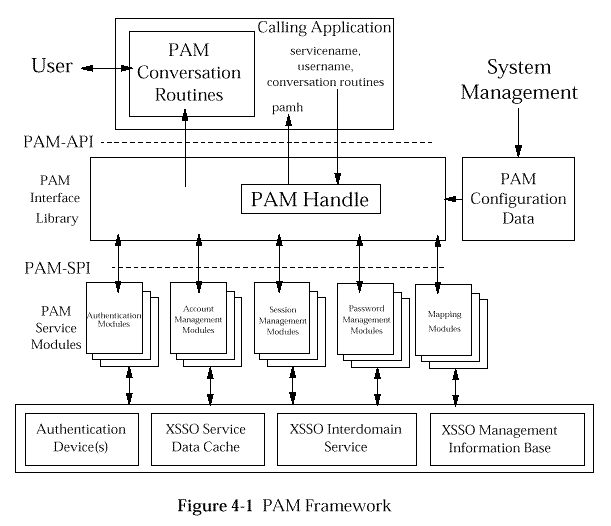
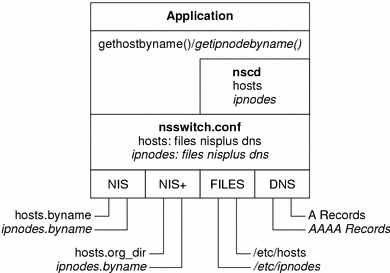
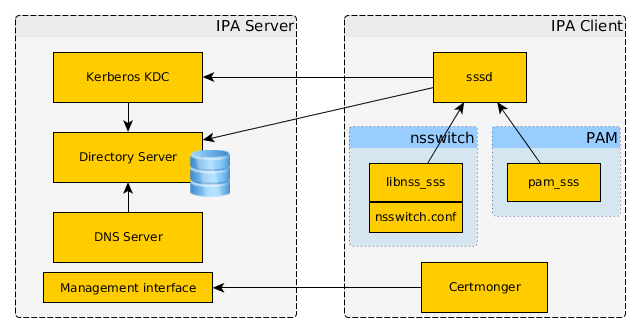
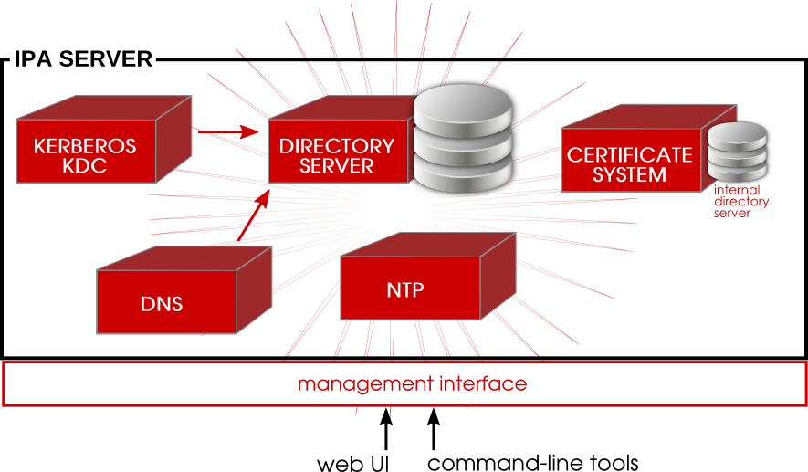
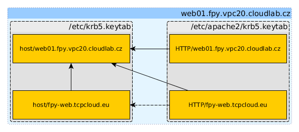

:css: ./default.css
:skip-help: true

.. title:: FreeIPA Introduction

FreeIPA Introduction
====================

Filip Pytloun
-------------

----

What is FreeIPA?
================

- IPA is about

  - Identity - machine, user, virtual machines, groups, authentication credentials
  - Policy - host based access control
  - Audit

- "Active Directory" for Unix and Linux
- provides centralized authentication, authorization and account information
- built on top of opensource components and protocols

----

Authentication vs. Authorization
--------------------------------

A little sidenote on naming:

**Authentication** is the process of ascertaining that somebody really is who
he claims to be.

**Authorization** refers to rules that determine who is allowed to do what.

----

FreeIPA Server Components
=========================

- Linux
- 389 Directory Server (LDAP, data backend)
- MIT Kerberos (core of FreeIPA authentication)
- NTP, DNS
- Dogtag (Certificate system)
- Web and CLI provisioning and administration tools

----

LDAP
----

- Lightweight Directory Access Protocol
- hierarchical read optimized database

- consists of **objects** with **attributes**
- LDAP is using predefined **schemes** with conventions of common object and
  attribute types (eg. ``inetOrgPerson`` `object class <https://tools.ietf.org/html/rfc2798#section-2>`_ for address books)

----

``uid=admin,cn=users,cn=accounts,dc=tcpcloud,dc=eu``

^- ``dn`` (distinquished name = absolute address) of admin user

- adressing objects from right to left
- ``cn`` - common name
- ``ou`` - organisation unit
- ``dc`` - domain component
- ``dn`` - distinquished names (absolute address of an entry)

----

.. code-block:: yaml

    dn: uid=admin,cn=users,cn=accounts,dc=tcpcloud,dc=eu
    krbLastSuccessfulAuth: 20160229111009Z
    krbLoginFailedCount: 0
    krbLastFailedAuth: 20160223145934Z

    memberOf: cn=admins,cn=groups,cn=accounts,dc=tcpcloud,dc=eu
    memberOf: cn=Replication Administrators,cn=privileges,cn=pbac,dc=tcpcloud,dc=eu
    ...

    objectClass: top
    objectClass: person
    objectClass: posixaccount
    objectClass: krbprincipalaux
    objectClass: krbticketpolicyaux
    objectClass: inetuser
    objectClass: ipaobject
    objectClass: ipasshuser
    objectClass: ipaSshGroupOfPubKeys

    uid: admin
    krbPrincipalName: admin@TCPCLOUD.EU
    cn: Administrator
    sn: Administrator
    uidNumber: 96400000
    gidNumber: 96400000
    homeDirectory: /home/admin
    loginShell: /bin/bash
    gecos: Administrator

----

LDAP client usage
~~~~~~~~~~~~~~~~~

- anonymous binds are disabled in most cases so we need to authenticate
- using password

.. code-block:: bash

    ldapsearch \
     -D uid=apache,cn=users,cn=accounts,dc=tcpcloud,dc=eu \  # Bind DN
     -w somersecretpassword \
     -b dc=tcpcloud,dc=eu   \  # Base DN
     -h idm01.tcpcloud.eu   \  # Host to bind
     -ZZ \  # Use and enforce TLS (non-encrypted binds may be disabled)
     "(uid=admin)"  # Search expression

----

- using kerberos

  .. code-block:: bash

      kinit admin@TCPCLOUD.EU

      ldapsearch \
        -Y GSSAPI \
        -b dc=tcpcloud.eu    \
        -h idm01.tcpcloud.eu \
        -ZZ \
        "(uid=admin)"

----

.. image:: ./images/kerberos-logo.jpg
   :class: pull-right

Kerberos
--------

- three-headed dog guarding the gates to the underworld in Greek mythology
- network authentication protocol
- SSO capabilities (only single login per session)

  - obtained credentials are then passed between resources

- concept depends on centralized **KDC** (Key Distribution Center)

  - KDC is aware of all systems in the network and is trusted by them

- performs mutual authentication

  - client provides identity to server
  - server provides it's identity to client

- Windows 2000 and newer are using kerberos protocol as primary authentication
  method (with some additions)

----

Architecture
~~~~~~~~~~~~

- kerberos communication is based on **tickets**

  - encrypted data scheme saved on client-side

- **TGT** (Ticket Granting Ticket) is obtained on successful authentication,
  stored in ticket cache and used for SSO purposes

  .. code-block:: bash

      $ kinit filip.pytloun@TCPCLOUD.EU
      Password for filip.pytloun@TCPCLOUD.EU:

      $ klist
      Ticket cache: FILE:/tmp/krb5cc_1000
      Default principal: filip.pytloun@TCPCLOUD.EU

      Valid starting       Expires              Service principal
      03/01/2016 13:28:40  03/01/2016 23:28:40  krbtgt/TCPCLOUD.EU@TCPCLOUD.EU
      	renew until 03/02/2016 13:28:37

----

- **TGS** (Ticket Granting Service) is obtained by Ticket Granting Server on
  successful identification through TGT. It's used when contacting kerberized
  service.

  .. code-block:: bash

      $ curl -q -u: --negotiate https://doc.tcpcloud.eu

      $ klist
      ...
      03/01/2016 13:33:34  03/01/2016 23:28:40  HTTP/doc.tcpcloud.eu@
	renew until 03/02/2016 13:28:37
      03/01/2016 13:33:34  03/01/2016 23:28:40  HTTP/doc.tcpcloud.eu@TCPCLOUD.EU
	renew until 03/02/2016 13:28:37

- KDC consists of 3 parts

  - Authentication Server (AS) which answers authentication requests from
    clients and sends TGT
  - Ticket Granting Server which issues TGS to a client which allows
    authentication against kerberized services
  - database where all secret keys are stored

----

----

- **principal** is entity in kerberos realm - can represent users, hosts or
  services

  - consists of 3 parts: ``username/instance@REALM``, eg.:

    - ``admin@TCPCLOUD.EU``
    - ``host/test.cloudlab.cz@TCPCLOUD.EU``
    - ``HTTP/doc.tcpcloud.eu@TCPCLOUD.EU``

- **keytab** (key table) is a file containing long-term keys for service

  - it's content is shared secret between KDC and service itself
  - it acts in the same manner as password to authenticate human principals
  - one keytab can contain multiple keys
  - **KVNO** (Key version number) is incremented every time
    the key is changed

  .. code-block:: bash

      $ klist -k /etc/apache2/ipa.keytab -t
      Keytab name: FILE:/etc/apache2/ipa.keytab
      KVNO Timestamp           Principal
      ---- ------------------- ---------------------
      1 01/28/2016 11:34:52 HTTP/jenkins.tcpcloud.eu@TCPCLOUD.EU

----

Example service - Apache
~~~~~~~~~~~~~~~~~~~~~~~~

- Kerberos authentication is provided by ``auth_kerb`` module

  .. code-block:: bash

      apt-get install libapache2-mod-auth-kerb
      a2enmod auth_kerb

- Keytab needs to be obtained from FreeIPA server and permissions correctly
  set

  .. code-block:: bash

      ipa-getkeytab -k /etc/apache2/ipa.keytab -p HTTP/test.tcpcloud.eu -s idm01.tcpcloud.eu
      chown root:www-data /etc/apache2/ipa.keytab
      chmod 640 /etc/apache2/ipa.keytab

----

- Enable kerberos authentication in virtualhost configuration

  .. code-block:: apache

    AuthType Kerberos
    # Negotiate method to use TGS from client
    KrbMethodNegotiate on
    # If client doesn't support negotiate, return 401
    # so it can authenticate by sending username/password
    KrbMethodK5Passwd on
    # Cache credentials in case that negotiate is not supported
    KrbSaveCredentials on
    KrbServiceName HTTP
    KrbAuthRealms TCPCLOUD.EU
    Krb5KeyTab /etc/apache2/ipa.keytab

----

It may be also necessary to authorize users by group membership. This can be
achieved by using ``authnz_ldap`` module.

Unfortunately it doesn't support GSSAPI LDAP bind so we need to use password.

.. code-block:: apache

  AuthLDAPBindDN "uid=apache,cn=users,cn=accounts,dc=tcpcloud,dc=eu
  AuthLDAPBindPassword secretpassword
  AuthLDAPURL "ldaps://idm01.tcpcloud.eu idm02.tcpcloud.eu/dc=tcpcloud,dc=eu?krbPrincipalName"
  Require ldap-attribute memberOf="cn=docs,cn=groups,cn=accounts,dc=tcpcloud,dc=eu"

----

NTP
---

Another FreeIPA service is NTP (Network Time Protocol).

It's very important to have clock in sync on all kerberos-integrated machines
because tickets are timestamped.

If you experience any troubles with kerberos, check that your clock is in sync
with clock on the server.

----

DNS
---

- **Bind9** is used as a DNS server
- it uses LDAP backend to read zones and records
- zones can be created/updated via FreeIPA web UI, API or using dynamic
  updates
- it's good idea to "hide" FreeIPA DNS servers and use zone transfer to slaves

  - so FreeIPA servers won't be abused by DNS queries
  - in case of FreeIPA service disruption, DNS zones will be still available

----

DNS dynamic updates
~~~~~~~~~~~~~~~~~~~

- dynamic updates can be used to set or update DNS records automatically from
  freeipa-integrated machine
- policies for dynamic updates can be set per-zone

  - by default, principal can update record for itself (eg.
    ``host/doc.tcpcloud.eu`` can set record ``doc`` in zone ``tcpcloud.eu``
- dynamic updates are disabled by default

  .. code-block:: bash

      ipa dnszone-mod tcpcloud.eu --dynamic-update=1

----

- create nsupdate file

.. code-block:: bash

  # Set server, otherwise it will use NS records
  # (which may point only to DNS slaves)
  server idm01.tcpcloud.eu
  # First delete old records
  update delete doc.tcpcloud.eu. IN A
  update delete doc.tcpcloud.eu. IN AAAA
  send
  # Also delete reverse record
  update delete 82.98.22.185.in-addr.arpa PTR
  send

  # Set A record for given zone
  update add doc.tcpcloud.eu. 1800 IN A 185.22.98.82
  send
  # ..and the same for reverse
  update add 82.98.22.185.in-addr.arpa 1800 PTR doc.tcpcloud.eu
  send

- kinit and update zone

  .. code-block:: bash

      kinit -kt /etc/krb5.keytab host/doc.tcpcloud.eu
      nsupdate -g /etc/nsupdate-doc.tcpcloud.eu
      kdestroy

----

FreeIPA Client
==============

- based on standard protocols

  - any LDAP/Kerberos enabled client can interoperate

- additional features achieved by using **sssd**

  - tends to be common framework for access to remote authentication and
    identity resources
  - provides caching and offline support

    - yes, you can integrate your laptop with FreeIPA :-)

  - provides `PAM
    <https://en.wikipedia.org/wiki/Pluggable_authentication_module>`_
    (Pluggable Authentication Module) and `NSS
    <https://en.wikipedia.org/wiki/Name_Service_Switch>`_ (Name Service
    Switch) modules

----

PAM Framework
-------------

----

Name Service Switch
-------------------

- use ``getent`` to do NSS queries

  - ``getent passwd admin``

- configured in ``/etc/nsswitch.conf``

  ::

    passwd:         compat sss
    group:          compat sss
    shadow:         compat

    hosts:          files dns
    networks:       files
    ...

- See `nsswitch.conf
  <http://man7.org/linux/man-pages/man5/nsswitch.conf.5.html#FILES>`_ man
  page, FILES section for more informations

----

----

FreeIPA Management
==================

- directly by manipulating LDAP *(better don't)*
- Web UI and `JSON-RPC
  <https://vda.li/en/posts/2015/05/28/talking-to-freeipa-api-with-sessions/>`_
- CLI and Python API

----

Example client
--------------

- Primary host: ``web01.fpy.vpc20.cloudlab.cz``
- Other hosts: ``fpy-web.cloudlab.cz``
- Webserver with GSSAPI support for both hosts

  - ``HTTP/$(hostname -f)``
  - ``HTTP/fpy-web.cloudlab.cz``

----

Add hosts
~~~~~~~~~

- create primary host

  .. code-block:: bash

      ipa host-add \
        --force \
        --password=cloudlab \
        web01.fpy.vpc20.cloudlab.cz

- create host for external access

  .. code-block:: bash

      ipa host-add --force fpy-web.tcpcloud.eu

  - let it be managed by primary host

    .. code-block:: bash

      ipa host-add-managedby \
        --hosts=web01.fpy.vpc20.cloudlab.cz \
        fpy-web.tcpcloud.eu

----

Client join
~~~~~~~~~~~

- install ``freeipa-client``
- join FreeIPA

  .. code-block:: bash

      ipa-client-install \
        --server idm01.tcpcloud.eu \
        --domain fpy.vpc20.cloudlab.cz \
        --realm TCPCLOUD.EU \
        --hostname web01.fpy.vpc20.cloudlab.cz \
        -w cloudlab \
        --mkhomedir --enable-dns-updates --unattended

Since that, client is enrolled, can kinit and authenticate to other services
(eg. to update DNS records, etc.)

----

Add services
~~~~~~~~~~~~

- create HTTP services for both hosts

  .. code-block:: bash

      ipa service-add --force HTTP/web01.fpy.vpc20.cloudlab.cz
      ipa service-add --force HTTP/fpy-web.tcpcloud.eu

- services are automatically managed by their hosts
- we can also add management of external host to primary one

   .. code-block:: bash

       ipa service-add-host \
         --hosts=web01.fpy.vpc20.cloudlab.cz \
         fpy-web.tcpcloud.eu

----

Keytab for webserver
~~~~~~~~~~~~~~~~~~~~

Now we can simply obtain keytabs for our HTTP service.

- first kinit as primary host

  .. code-block:: bash

      kinit -kt /etc/krb5.keytab host/web01.fpy.vpc20.cloudlab.cz

- get keytab for HTTP service for both hosts

  .. code-block:: bash

      ipa-getkeytab \
        -k /etc/apache2/krb5.keytab \
        -s idm01.tcpcloud.eu \
        -p HTTP/fpy-web.tcpcloud.eu

- verify that you can kinit with newly obtained keytab

  .. code-block:: bash

      kinit -kt /etc/apache/krb5.keytab HTTP/fpy-web.tcpcloud.eu

----

Hostgroups
----------

- hostgroups are used for logical grouping of hosts
- and to make assigning of RBAC and sudo rules easier
- hostgroups can be nested

.. code-block:: bash

    ipa hostgroup-add --hosts=web01.fpy.vpc20.cloudlab.cz fpy-servers
    ipa hostgroup-add --hosts=fpy-web.tcpcloud.eu fpy-servers

----

Role-Based Access Control
-------------------------

- RBAC rules define rules for access to hosts
- eg. allow users in group ``admins`` access hosts in hostgroup
  ``internal-systems`` via service ``sshd``

  - such users will be allowed to login via SSH but not on console, via FTP,
    etc.
- service groups can be defined to include all services of the same type

  - eg. ftp = vsftpd, pure-ftpd, etc.

- FreeIPA web UI has awesome HBAC testing tool

----

Sudo rules
----------

- sudo rules define who can run which commands on which hosts and as which
  user/group

  - eg. allow users in group ``django-admins`` to execute ``/usr/bin/python``
    as user ``www-data`` on hosts in hostgroup ``web-servers``

- sudo command groups can be created to allow access to set of commands
- options can be assigned to rules (eg. ``!authenticate``, ``requiretty``)

----

Next topics
===========

- DNS zones and records

Advanced
--------

- Certificate management
- FreeIPA roles, privileges and permissions
- automount

----

Reference
=========

- `About FreeIPA <http://www.freeipa.org/page/About>`_
- `inetOrgPerson <https://tools.ietf.org/html/rfc2798#section-2>`_
- `Kerberos howto <http://helkyn.free.fr/krb5/kerberos.html>`_
